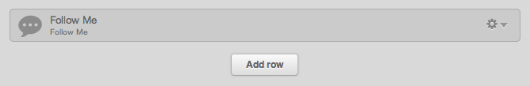
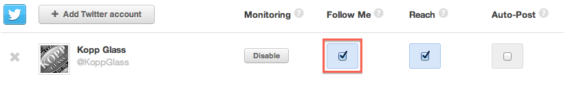

Custom Social Icons for Follow Me Widget
================================================
This snippet will show you how override the default social icons for the COS Follow Me Module with custom social icons of your choice.

COS Default Icons:
 

Custom Icons:
 

Step 1
------
In the Template Builder add a Follow Me module to a template.
 

Step 2
------ 
In the COS Social Settings, ensure social accounts have been added and checked off for the "Follow Me" option.
 

Step 3
------
If the customer's website did NOT use an image sprite for the social icons (and instead saved each social icon image individually), then you will need to manually create an image sprite that contains all the icons in one file, including the hover states.  If you do not know how to create an image sprite then follow the tutorial here: http://css-tricks.com/css-sprites/.  When your image sprite is ready, upload it to the COS via the File Manager.

If the customer DID use an image sprite for their social icons, simply save that image and upload it to the COS via the File Manager.

Image Sprite Example:
 

Step 4
------
Add the CSS to the "Components" section of the boilerplate CompanyCustom.css file.

Step 5
------
In the CSS, update the ".widget-type-follow_me .cell-wrapper div span" selector so that the background URL is the URL of the sprite that was uploaded in step 3 and so that the height and width are set.

Step 6
------
Update the background positions, while consulting the image sprite, for the default and hover states for each appropriate Social Icon Selector.