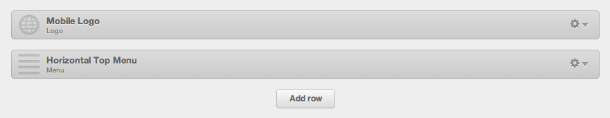

Header With a Centered Logo
================================================
The following tutorial will show you how to create a horizontal menu containing a centered logo.  The result should look very simlilar to the image below.

 

Step 1
------
Within your global header module, create a "Logo" module stacked on top of a "Horizontal Menu" module. The "Logo" module will display only for mobile, while the "Horizontal Menu" module will display for both desktop and mobile.

 

The "Mobile Logo" module needs a CSS class of "visible-phone".

The "Horizontal Top Menu" module needs a CSS class of "custom-menu-primary".

Step 2
------
Create a new item in your site map and position it to the very center of the list.  Set the link's display name as the company name and have it link to the homepage.

Step 3
------
Add the Desktop CSS to the "Custom Menu Primary" section of the boilerplate CompanyStyle.css file. If your stylesheet is using the most recent version of the boilerplate, then you can just grab the properties for each selector and paste them into the existing matching selectors in the "Parent List" sub-section.

Step 4
------
In the code that was added in step 3, you will need to update the width of the LI.  Find this number by dividing the number 10 by the number of items you have in the site map (including the logo), and then move the decimal point over once to the right.

Step 5
------
Add the Mobile CSS to the "max-width: 767px" media query section of the boilerplate CompanyStyle.css file.

Step 6
------
In the code that was added in step 3 and in 5 (both desktop and mobile), update the :nth-child values for ".custom-menu-primary .hs-menu-wrapper >ul > li:nth-child(4) > a" so it matches the index of the li that contains the logo.

