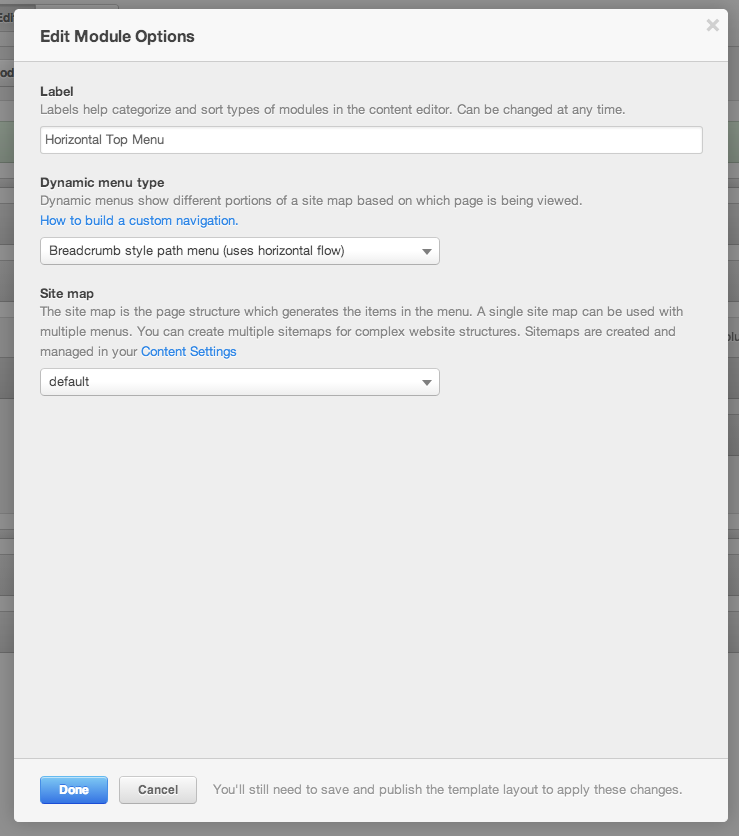

Prepend "Home" Link to Breadcrumb
================================================
This snippet will add a "home" link to the beginning of the COS Breadcrumb module. This is a work around since the module currently does not have a built in option for this.  The result should look similar to the image below:

 

Step 1
------
Add a Horizontal Top Menu module to one of your templates, and in it's Module Options set the Dynamic Menu Type to "Breadcrumb style path menu (uses horizontal flow)".

 

Step 2
------
Add the JS to your boilerplate CompanyMain.js file. Make sure it is inside of the document ready function.