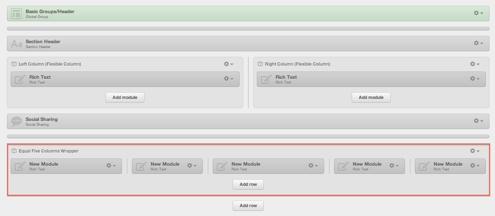
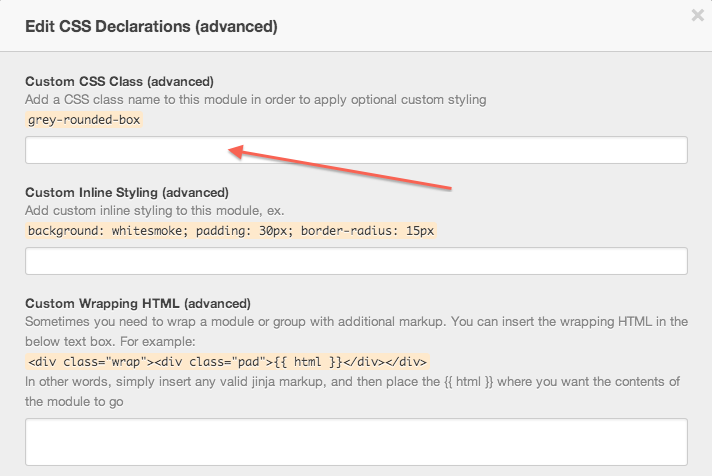
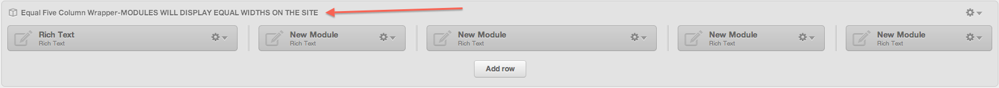

Create A Row Containing an Odd Number of Modules
================================================
By default, the Bootstrap Grid used by the COS does not accomodate an odd number of columns. This becomes a problem when a customer's footer, for instance, requires 5 equal columns of content. Follow the steps below for an easy workaround to this issue.

Step 1
------
In the template builder, create a row with 5, 7, 9, or 11 modules.  Your modules should be unequal widths in the template builder.

 

Step 2
------
Wrap them all in a module group.

Step 3
------
Select the appropriate class below and apply it as the 'Custom CSS Class' of the module group.

* .five-col-wrapper
* .seven-col-wrapper
* .nine-col-wrapper
* .eleven-col-wrapper

 

Step 4
------
For clarity purposes, add the follow as the label for the module group: "MODULES WILL DISPLAY EQUAL WIDTHS ON THE SITE".

 

Step 5
------
Grab the appropriate CSS and place it in the "Components" section of the boilerplate CompanyCustom.css file.  Remember to copy the desktop styles AND the mobile styles (it is a good idea to paste the mobile portion in the Mobile section at the bottom of the stylesheet.